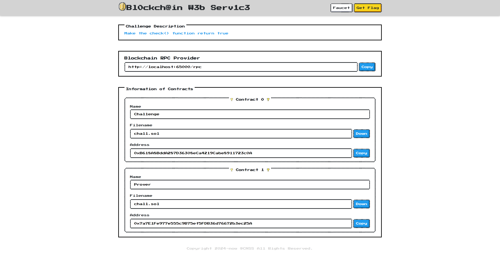
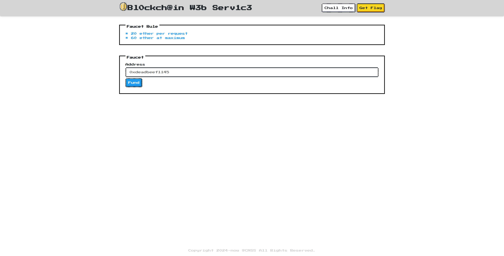
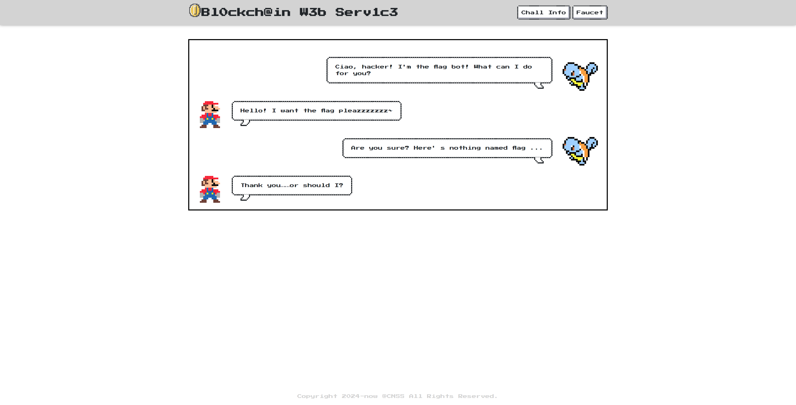
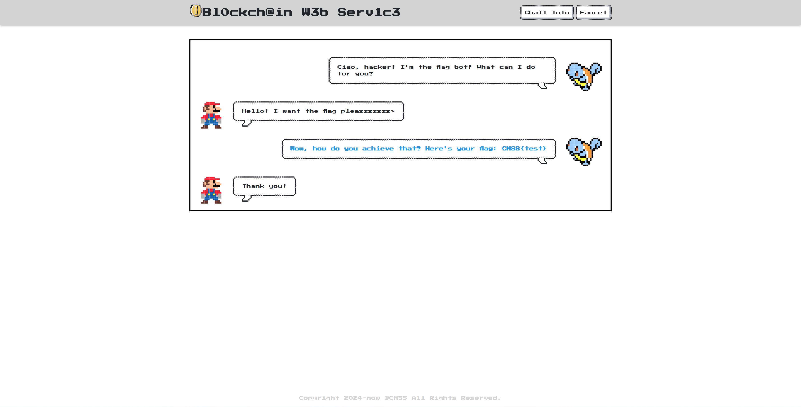

# blockchain-template

This is a CTF blockchain challenge template


## ScreenShot

### Home



### Faucet



### Flag





## Usage

- Put challenge contracts in app/contracts
- Create config.yml from config.yml.example 


## Feature
- Configurable
- RPC filtered
- Stable
- Beautiful UI


## Config

```yaml
description: |
  Make the check() function return true

wrong_flag_message: Are you sure? Here' s nothing named flag ...

faucet:
  enabled: True
  amount: 20
  unit: ether
  limit:
    amount: 60
    unit: ether

deployer:
  balance:
    amount: 1000000000
    unit: ether

contracts: 
  - type: source
    filename: chall.sol
    name: Challenge
    constructor:
      args: []
      value:
        amount: 10000
        unit: ether
      # gas: "0"
    checks: []
    visible: True
    show_file: True
    show_address: True
    show_filename: True

  - type: source
    filename: chall.sol
    name: Prover
    constructor:
      args: []
      value:
        amount: 0
        unit: wei
      # gas: "0"
    checks:
      - func: check
        args: []
        value:
          amount: 0
          unit: wei
        # gas: "0"
        check: True
    visible: True
    show_file: True
    show_address: True
    show_filename: True

solc:
  version: "0.7.6"
  evm_version: "istanbul"

genesis:
  chain_id: 1337
  timestamp: "0x609ac710"
  gas_limit: "0x1312d00"
  difficulty: "0x1"
```

